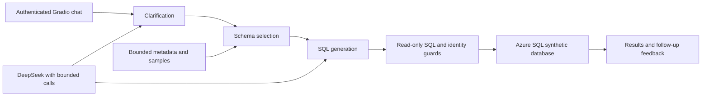
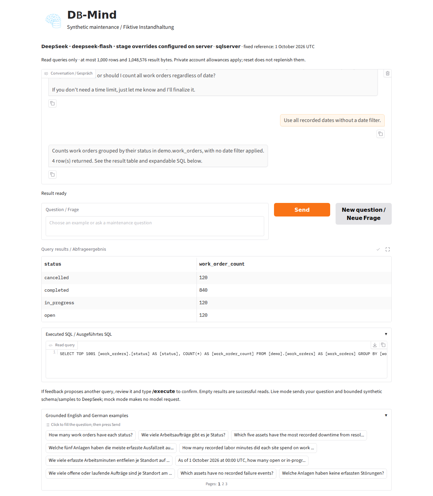

# DB-Mind (Azure Demo)

DB-Mind is an authenticated English/German chatbot for maintenance analytics over
**entirely fictional data**: nine tables and 3,390 rows. Explore work-order status,
downtime, repair time, parts use, and maintenance plans. Ambiguous metrics and date
windows trigger clarification; follow-up questions and feedback support refinement.
Results include a table and expandable SQL.

[Hosted private demonstration](https://dbmind-demo.lemonflower-af0fa12b.southafricanorth.azurecontainerapps.io)
requires an invited account. [Deployment report](docs/deployment-report.md) records
observed acceptance checks, resource costs, and remaining operator steps.



Azure Container Apps serves the private UI over HTTPS with one replica. Managed
identity pulls the immutable image from ACR. ODBC Driver 18 uses verified TLS and
a restricted database reader. Azure failures have no SQLite fallback.



[Actual mobile example](docs/images/demo-mobile.png)

## Local quick start

Linux amd64 and Python 3.12 are the validated release environment. Installation
requires network access; this mock workflow makes no model or Azure calls.

```bash
python3.12 -m venv .venv
source .venv/bin/activate
python -m pip install --require-hashes -r requirements.lock
python -m pip check
python -m synthetic_demo.seed sqlite --output var/synthetic/maintenance_v1.sqlite3
python -m synthetic_demo.check --database var/synthetic/maintenance_v1.sqlite3
python -m src.discovery preflight
export APP_USERNAME=demo
read -rsp 'Private demo password (12+ characters): ' APP_PASSWORD
export APP_PASSWORD
export APP_LLM_MODE=mock GRADIO_ANALYTICS_ENABLED=False HF_HUB_OFFLINE=1
python app.py
```

Open `http://127.0.0.1:7860`, authenticate, choose an example, and press **Send**.
Seed refuses an existing target; validate an existing fixture instead. This local
SQLite workflow is distinct from the hosted Azure SQL workflow. The fixed
synthetic reference date is 1 October 2026 UTC.

## Azure SQL and DeepSeek

Follow the [deployment guide](docs/azure-deployment.md). Configuration is explicit;
the app does not automatically load `.env`. Azure requires `DB_PROFILE=azure_sql`,
`DB_DIALECT=sqlserver`, `DB_SCHEMA_SCOPE=demo`, and
`DB_DISCOVERY_TIMEOUT_SECONDS=300`. Leave `DB_SQLITE_PATH` unset. Startup discovery
never seeds Azure; it inspects accessible catalogs and samples up to five bounded
rows per small table. Incomplete, expired, or mismatched snapshots fail closed.
See [discovery](docs/discovery.md) and [configuration](docs/configuration.md).

Live mode requires `APP_LLM_MODE=live` and a private `DEEPSEEK_API_KEY`. Models are
explicit server configuration: `deepseek-flash` by default, with optional
per-stage `deepseek-v4-pro`. Questions, bounded synthetic schema/sample context,
and limited feedback context go to DeepSeek. Use fictional data and invited users.
[Provider settings](docs/deepseek.md) document transport and token controls.

Defaults: two questions/user/hour, ten/day, 24 model attempts/user/hour, 120
globally/day, and 12 attempts/300 seconds per question. Retries count. Provider
billing caps are separate. [Safety controls](docs/safety.md) describe authentication,
read gates, blocked file routes, quotas, and cancellation.

## Verification and limitations

The clean checkout passes **91 offline tests**, covering real SQLite/HTTP behavior
and mocked provider/security failures. Checks inside the hosted Container App
confirmed nine Azure SQL tables, complete metadata and sampling, equipment count
60, and the restricted reader guard passing. HTTPS readiness returned 200;
anonymous config returned 401. Both mock and one live DeepSeek conversation
returned the exact synthetic status counts. Actual SQL, TLS certificate and
permission failures stopped safely. [Deployment evidence](docs/deployment-report.md)
separates these results from earlier [Codespace checks](docs/azure-integration-verification.md).

```bash
GRADIO_ANALYTICS_ENABLED=False HF_HUB_OFFLINE=1 APP_LLM_MODE=mock \
  python -B -m unittest discover -s tests -q
```

These are engineering checks, not thesis accuracy results or a measurement of
general natural-language accuracy. Mock mode recognizes exact bilingual reference
questions; live mode uses the provider. Screenshots show actual hosted live
results over the fictional fixture, including a date clarification follow-up.

Discovery can take several minutes from a distant Codespace. SQL may pause,
including at free-offer exhaustion. Sessions and quotas live in memory and reset
on process restart; use one process and one replica. Readiness checks startup
state, not continuous SQL availability. Elevated-identity and nested-role
impersonation rejection still have offline regression coverage only.

## Portfolio provenance

This repository has fresh Git history and excludes original warehouse schemas,
research data, embeddings, logs, backups, certificates, and generated caches.
The original `AM-Hejazi/DB-Mind` repository and history are preserved.
[Cleanup manifest](docs/cleanup-manifest.md) records omissions and retained assets.
The original `data/icon.png` logo is embedded as a trusted data URI, preserving
blocked Gradio file routes. No new license or ownership grant is inferred.

### Recruiter demo sessions

Authenticated browsers receive an opaque, HttpOnly, same-site visit cookie. Each
visit has a fixed 30-minute deadline from its first authenticated page request.
Reloads, activity, new tabs and “New question” do not extend that deadline. At
expiry the page displays: “Your 30-minute demo session has ended. Please contact
the developer to request more access.” The server rejects subsequent requests
and checks expiry before queued work, database reads and each model attempt.

Request, question and model allowances are isolated per browser visit so people
sharing the demo login do not consume each other's individual allowances. Asset
loads, page refreshes and deadline polling do not consume the action allowance.
The overall daily model-call cap and serialized operation capacity still apply.
`APP_SESSION_TTL_SECONDS` defaults to 1800 and cannot exceed 1800. Visits are held
in memory; run one replica. Restarting the process invalidates existing visits.

A shared password cannot identify a person: clearing the visit cookie or using
another browser can start a new visit. For strict access per recruiter, distribute
individual credentials and use persistent account-level expiry before making
that promise. This demo enforces a browser-visit limit, not a permanent lockout
for a human identity.

Changing the hosted login secret only requires restarting the active Azure
revision. Code changes require building and deploying a new image. Update your
private `~/dbmind-azure.env` password as well; the full deployment script reads
that file and would otherwise replace the hosted password with its old value.
An image-only Container App update preserves the hosted secret.

### Changing a result with a follow-up

After a result, ask naturally—for example, “how about last 6 months” or
“change the query to the last 6 months.” DB-Mind proposes a replacement read
query through the Feedback → Candidate Generator (CG) → validation loop, using
the current question, SQL, schema and latest request. Review
the proposal in the conversation and send `/execute` to run it. Existing
results remain visible until confirmation succeeds; subsequent follow-ups
then use the updated question and results. Clarifications or a new revision
invalidate an older unexecuted proposal. The SQL safety gate, runtime permission
guard, visit expiry and model/query limits apply to follow-ups as well.

The follow-up path preserves the thesis's agent roles: Feedback interprets the
update; CG creates SQL using the selected schema and prior query context; the
Validator boundary checks and executes the approved read. Only an actual query
error can invoke Analyzer, at most once for follow-up repair. Its repaired SQL
is a new proposal requiring another `/execute`, and the original result remains
visible until a revised read succeeds. Empty results and connectivity failures
do not invoke repair. This engineering demo's bounded checks are not thesis
accuracy scores or a claim of complete semantic validation.
