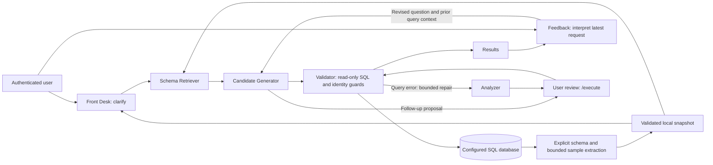

# DB-Mind

DB-Mind is an authenticated English/German chatbot that turns questions into
bounded, read-only SQL queries. Its agents clarify intent, retrieve relevant
schema, generate and validate SQL, and refine results through conversational
feedback. Results include a table and the executed SQL.

The architecture is designed for different SQL domains. This release provides
SQLite and SQL Server/Azure SQL transports with a fictional maintenance dataset
(nine tables, 3,390 rows). **An unrelated database schema requires adaptation:**
the current profiles enforce the approved synthetic contract. PostgreSQL/MySQL
connectors are not included. Start with [your own database setup](docs/own-database-setup.md)
for the supported deployment path and the implementation needed for another schema.

[Hosted demonstration](https://dbmind-demo.lemonflower-af0fa12b.southafricanorth.azurecontainerapps.io)
requires an invited account. To run an independent deployment, use your own Azure
subscription, resources, database identity and secrets.

## Architecture



Front Desk resolves ambiguity; Schema Retriever selects verified schema context;
Candidate Generator creates SQL; the Validator applies query and identity guards.
Feedback interprets a follow-up and routes revisions back through generation and
validation. Analyzer can propose a bounded repair after a query error.


[Mobile demonstration](docs/images/demo-mobile.png)

## Try locally without model calls

Use Linux amd64 and Python 3.12. Dependency installation downloads packages;
mock mode makes no model or Azure requests.

```bash
python3.12 -m venv .venv
source .venv/bin/activate
python -m pip install --require-hashes -r requirements.lock
python -m pip check
python -m synthetic_demo.seed sqlite --output var/synthetic/maintenance_v1.sqlite3
python -m synthetic_demo.check --database var/synthetic/maintenance_v1.sqlite3
python -m src.discovery preflight
export APP_USERNAME=demo
read -rsp 'Application password (12+ characters): ' APP_PASSWORD
export APP_PASSWORD
export APP_LLM_MODE=mock GRADIO_ANALYTICS_ENABLED=False HF_HUB_OFFLINE=1
python app.py
```

Open `http://127.0.0.1:7860`, sign in, choose an example and press **Send**.
Seeding refuses an existing file; check an existing fixture instead of reseeding.
Mock mode recognizes the bilingual reference examples. Live mode requires a
private DeepSeek key and sends questions and bounded database context to the
provider. The sample dataset uses 1 October 2026 UTC as its reference date.

## Set up your Azure SQL deployment

1. Follow [database setup](docs/own-database-setup.md) to prepare an approved test
   database and separate restricted reader. Application startup never seeds SQL.
2. Configure the connection privately using [configuration](docs/configuration.md).
   Environment variables are explicit; `.env` is not automatically loaded.
3. Run schema/sample extraction and inspect the snapshot with
   [discovery commands](docs/discovery.md). Disable row samples with
   `DB_SAMPLE_ROWS=0` if required by your data policy.
4. Build the Azure Docker target and publish through the
   [Azure deployment guide](docs/azure-deployment.md), using your own resource names.
5. Configure [model access](docs/deepseek.md), test read-only reference questions,
   and review [security and access controls](docs/safety.md) before inviting users.

Schema, enabled samples, questions and limited result/feedback context can leave
your network in live mode. Use approved sanitized data and review provider/data
policies before adapting the app to a sensitive database.

## Refine a result

Ask a follow-up such as “how about last 6 months.” DB-Mind proposes a replacement
query using the current question, SQL and selected schema. Review it and send
`/execute` to run it. Results stay visible until the revised read succeeds;
later follow-ups use the updated question and results. Clarification or another
revision invalidates an older unexecuted proposal. A repaired query also requires
fresh confirmation.

## Authentication and limits

Every application route requires authentication; minimal health probes are public.
Configure `APP_USERNAME`/`APP_PASSWORD` or multiple users through `APP_AUTH` in a
private environment file/secret store. Use HTTPS remotely. No password is supplied
by the repository.

Demo visits expire after 30 minutes. Allowances are per browser visit: by default
two questions/hour, ten/day and 24 model attempts/hour. The shared model allowance
is 120/day; each question has a 12-attempt/300-second budget. Retries count. These
are application controls, not provider billing caps or permanent per-person limits.

For a separate application admin, configure `APP_ADMIN_USERNAME` and
`APP_ADMIN_PASSWORD` privately. Admin visits have no fixed visit deadline or
individual question/model allowance, but keep the global spending cap, per-question
budgets, HTTP rate limits and SQL protections. Admin access grants no database
administration privileges. See [access configuration](docs/safety.md).

For password-only Azure secret updates, restart active revisions; no image rebuild
is needed. Keep the private deployment env file synchronized before using the full
deployer, because it reapplies secrets. See [password rotation](docs/azure-deployment.md#rotate-an-application-password).

## Development and operating limits

Run the offline test suite:

```bash
GRADIO_ANALYTICS_ENABLED=False HF_HUB_OFFLINE=1 APP_LLM_MODE=mock \
  python -B -m unittest discover -s tests -q
```

Tests cover database/HTTP behavior and mocked model/security failures; they are
not a general accuracy benchmark or a security certification. SQL generation can
be incorrect even when a query passes the read-only gate: review intent and results.

Use one process and one replica: sessions, quotas and visit cookies have in-memory
state and reset on restart. Discovery can take several minutes. Readiness reflects
startup completion, not continuous database availability. Azure SQL authentication,
TLS, permission or query failures stop safely without a local fallback. Generated
snapshots, logs and secrets must stay out of Git and images.
